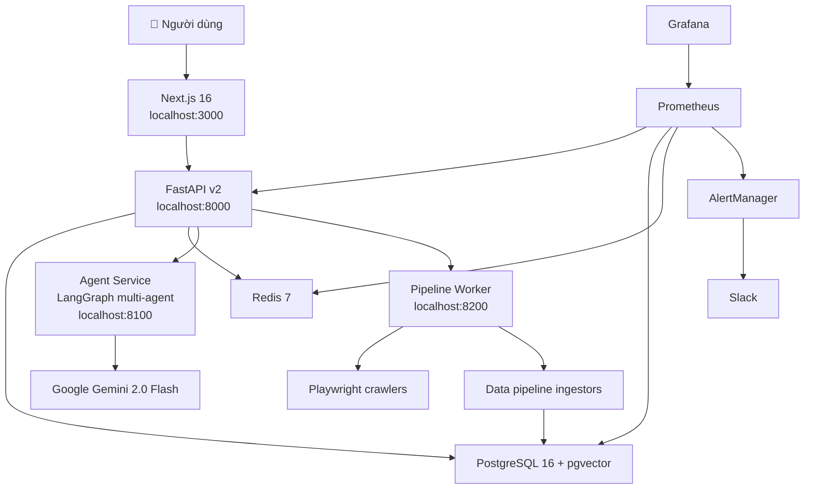

# RealEstate Chatbot v2

Nền tảng tìm kiếm, phân tích và tư vấn bất động sản Việt Nam — end-to-end từ crawl dữ liệu, xử lý pipeline, đến web frontend và chatbot multi-agent RAG.

## 🏗 Kiến Trúc Tổng Quan



## 📁 Cấu Trúc Dự Án

```
RealEstate_Chatbot_v2/
├── agent_service/          # Internal LangGraph multi-agent RAG service
│   ├── main.py             # FastAPI: /internal/agent/chat, /health, /evaluate
│   ├── config.py           # Agent settings (Pydantic)
│   ├── contracts.py        # AgentChatRequest/Response, Evidence, RetrievalTask
│   ├── agents/             # 6 specialist agents (property, market, legal, investment...)
│   ├── graph/              # LangGraph StateGraph: router → planner → specialists → synthesis
│   ├── llm/                # Gemini wrapper + cost tracking
│   ├── tools/              # Retrieval tools, readiness snapshot
│   └── evaluation/         # LLM-as-judge (5 metrics)
│
├── backend/                # FastAPI v2 (main backend)
│   ├── app/
│   │   ├── main.py         # Entrypoint: uvicorn app.main:app
│   │   ├── config.py       # Settings from .env
│   │   ├── database.py     # Async SQLAlchemy engine
│   │   ├── models/         # ORM: User, Listing, Project, Article, Chunk, Chat, PipelineRun...
│   │   ├── routers/        # admin, auth, chat, listings, market, metrics, preferences, projects
│   │   └── services/       # agent_service client, chatbot orchestrator, hybrid search
│   ├── alembic/            # Database migrations
│   └── tests/              # Pytest suite
│
├── frontend/               # Next.js 16 App Router + React 19 + Tailwind CSS 4
│   ├── app/                # /, /nha-dat-ban, /thi-truong, /dang-nhap, /admin...
│   ├── components/         # Layout, ListingCard, FilterPanel, ChatWidget, AdminDashboard
│   └── lib/                # api.ts, types.ts, utils.ts
│
├── pipeline_worker/        # Internal service: crawl, ingest, chunk, embed
│   ├── main.py             # FastAPI: /internal/pipeline/crawler, /csv-ingest...
│   ├── runner.py           # Run crawl modules
│   └── maintenance.py      # Cleanup, mark inactive listings
│
├── crawler/                # Playwright headless crawlers
│   ├── core/               # Parser helpers, CSV utils
│   ├── sale/               # Tin bán
│   ├── rent/               # Tin thuê
│   ├── projects/           # Dự án
│   └── news/               # Tin tức
│
├── data_pipeline/          # ETL: clean, enrich, chunk, embed, ingest
│   ├── ingestors/          # listings, projects, news, legal KB
│   └── legal/              # PDF/HTML legal parser
│
├── airflow/                # Airflow DAGs + docker-compose
├── infra/                  # Monitoring: Prometheus, Grafana, AlertManager configs
├── data/                   # CSV samples, knowledge base, raw crawl outputs
├── docs/                   # Architecture docs, implementation plans
├── docker-compose.yml      # Full stack: 11 services
└── .env                    # Environment variables
```

> ⚠️ **Lưu ý:** `backend/main.py` là legacy (đọc CSV trực tiếp). Entrypoint chính là `backend/app/main.py`. Tương tự, `chatbot/` và `batdongsancom-crawler/` là code cũ, chỉ tham khảo.

## 🚀 Chạy Nhanh Bằng Docker

**Yêu cầu:** Docker Desktop / Docker Engine + Compose v2.

```bash
# 1. Cấu hình biến môi trường (đã có sẵn .env trong repo)
# 2. Khởi động toàn bộ stack
docker compose up -d --build

# 3. Kiểm tra trạng thái
docker compose ps
```

### Các Service & Port

| Service | Port | Mô tả |
|---|---|---|
| **Frontend** | `3000` | Next.js web app |
| **Backend API** | `8000` | FastAPI REST API + Swagger docs |
| **Agent Service** | `8100` | LangGraph multi-agent (internal) |
| **Pipeline Worker** | `8200` | Crawl + ingest jobs (internal) |
| **PostgreSQL** | `5432` | Database chính + pgvector |
| **Redis** | `6379` | Cache |
| **Prometheus** | `9090` | Metrics collection |
| **Grafana** | `3001` | Dashboards (admin/admin) |
| **AlertManager** | `9093` | Cảnh báo → Slack |
| **Postgres Exporter** | `9187` | PG metrics |
| **Redis Exporter** | `9121` | Redis metrics |

### URLs quan trọng

| URL | Mô tả |
|---|---|
| http://localhost:3000 | Frontend |
| http://localhost:8000/docs | Backend Swagger UI |
| http://localhost:8000/api/v1/health | Backend health check |
| http://localhost:3001 | Grafana dashboards |
| http://localhost:9090 | Prometheus UI |
| http://localhost:8080 | Airflow UI (nếu chạy riêng) |

## 🛠 Phát Triển Local

### 1. Khởi động infrastructure

```powershell
docker compose up -d postgres redis
```

### 2. Cài dependencies

```powershell
python -m venv .venv
.\.venv\Scripts\Activate.ps1
pip install -r requirements.txt
```

### 3. Database migration

```powershell
cd backend
alembic upgrade head
cd ..
```

### 4. Chạy Agent Service (cho chatbot)

```powershell
$env:PYTHONPATH="$PWD;$PWD\backend"
$env:AGENT_ALLOW_DEV_INTERNAL_KEY="true"
uvicorn agent_service.main:app --reload --port 8100
```

### 5. Chạy Backend

```powershell
cd backend
uvicorn app.main:app --reload --port 8000
```

### 6. Chạy Frontend

```powershell
cd frontend
npm install
npm run dev
```

## ⚙️ Biến Môi Trường Chính

Xem đầy đủ trong `backend/app/config.py` và `agent_service/config.py`.

| Biến | Mặc định | Ý nghĩa |
|---|---|---|
| `DATABASE_URL` | local Postgres | SQLAlchemy async connection string |
| `REDIS_URL` | `redis://localhost:6379/0` | Redis connection |
| `GEMINI_API_KEY` | — | Google Gemini API key (cho LLM + judge) |
| `GEMINI_MODEL` | `gemini-2.0-flash` | Model Gemini |
| `JWT_SECRET_KEY` | demo secret | **Đổi khi deploy production** |
| `AGENT_INTERNAL_KEY` | dev key | Key xác thực nội bộ giữa các service |
| `AGENT_SERVICE_URL` | `http://localhost:8100` | URL agent service |
| `CHATBOT_AGENT_SERVICE_ENABLED` | `true` | Dùng agent service (thay vì inline) |
| `HF_EMBEDDING_MODEL` | `BAAI/bge-m3` | SentenceTransformer model |
| `EMBEDDING_DIM` | `1024` | Vector dimension (phải khớp pgvector schema) |
| `COHERE_API_KEY` | — | Bật rerank (optional) |
| `SLACK_WEBHOOK_URL` | — | Nhận cảnh báo qua Slack (optional) |

## 🤖 Chatbot Multi-Agent RAG

Hệ thống dùng **LangGraph StateGraph** với 8 node:

1. **context_builder** — Chuẩn hóa query + lấy context từ chat history
2. **readiness_checker** — Kiểm tra data source sẵn sàng
3. **router** — Phân tích intent, chọn specialist agents
4. **retrieval_planner** — Lập kế hoạch retrieval
5. **specialist_agents** — 6 agents chạy song song:
   - `property_search` — Tìm BĐS theo tiêu chí
   - `market_analysis` — Phân tích giá, xu hướng thị trường
   - `legal_advisor` — Tư vấn pháp lý (có disclaimer)
   - `investment_advisor` — Phân tích đầu tư, ROI (có disclaimer)
   - `news_agent` — Tin tức thị trường mới nhất
   - `project_agent` — Thông tin dự án BĐS
6. **synthesizer** — Tổng hợp kết quả, dedup sources
7. **safety_validator** — Kiểm tra disclaimer, evidence
8. **memory_proposals** — Đề xuất lưu preferences người dùng

### Hybrid Retrieval

1. **SQL filter** — Lọc candidate theo cấu trúc (loại BĐS, giá, diện tích, khu vực)
2. **Vector search** — pgvector kNN trên `chunks.embedding` (cosine distance)
3. **Rerank** — Cohere rerank (nếu có API key)
4. **Resolve** — Map chunks → parent records (listing/project/article)

## 📊 Monitoring

Stack monitoring gồm **Prometheus + Grafana + AlertManager**:

### Metrics thu thập

- `realestate_chat_requests_total` — Số lượng chat request
- `realestate_retrieval_latency_seconds` — Latency hybrid search (histogram)
- `realestate_listings_total` — Số tin đăng theo loại (sale/rent)
- `realestate_chunks_total` — Số chunks đã index
- `realestate_pipeline_runs_total` — Pipeline runs theo DAG + status
- `realestate_llm_cost_usd` — Chi phí LLM tháng hiện tại
- `realestate_llm_cost_budget_exceeded` — Cảnh báo vượt budget

### Alert Rules (8 rules)

| Cảnh báo | Mức độ |
|---|---|
| Backend / PostgreSQL / Redis DOWN | 🔴 Critical |
| Không có chat traffic trong 15 phút | 🟡 Warning |
| P95 retrieval latency > 2s | 🟡 Warning |
| Pipeline DAG fail liên tục | 🟡 Warning |
| LLM monthly budget exceeded | 🟡 Warning |
| PostgreSQL > 50 connections | 🟡 Warning |
| Redis memory > 85% | 🟡 Warning |

### Dashboards

- **RealEstate Pipeline** — Listings, chunks, pipeline runs, retrieval latency, chat rate
- **RealEstate Service Health** — Uptime, alerts, request rate, latency percentiles

Truy cập Grafana tại http://localhost:3001 (admin/admin).

## 📡 Backend API

Tất cả endpoint được mount tại `/api/v1`. Xem đầy đủ tại http://localhost:8000/docs.

### Danh sách Routers

| Router | Prefix | Mô tả |
|---|---|---|
| `listings` | `/api/v1/listings` | CRUD tin đăng, filter, sort, similar |
| `market` | `/api/v1/market` | Thống kê thị trường, giá theo KV, top locations |
| `chat` | `/api/v1/chat` | Chatbot multi-agent, sessions, history |
| `auth` | `/api/v1/auth` | Register, login, JWT |
| `preferences` | `/api/v1/preferences` | User preferences & memory |
| `projects` | `/api/v1/projects` | Dự án BĐS |
| `articles` | `/api/v1/articles` | Tin tức, legal KB |
| `admin` | `/api/v1/admin` | Traces, eval runs, agent health, pipeline readiness |
| `metrics` | `/metrics` | Prometheus exposition endpoint |

## 🕷 Crawler

Crawler dùng Playwright headless Chromium với stealth mode, retry, và parallel workers.

```powershell
# Crawl URLs
python -m crawler.sale.crawl_urls --pages 1 5 --output data/raw/sale_urls.csv --workers 4

# Crawl details
python -m crawler.sale.crawl_details --input data/raw/sale_urls.csv --output data/raw/sale_details.csv --workers 4 --limit 100

# Tương tự cho rent, projects, news:
python -m crawler.rent.crawl_urls ...
python -m crawler.projects.crawl_urls ...
python -m crawler.news.crawl_urls ...
```

## 📥 Data Pipeline

```powershell
# Ingest listings
python -m data_pipeline.ingestors.listings_ingestor --csv data/raw/sale_details.csv --batch-size 50

# Ingest projects
python -m data_pipeline.ingestors.projects_ingestor --csv data/raw/projects_details.csv --batch-size 25

# Ingest news
python -m data_pipeline.ingestors.news_ingestor --csv data/raw/news_articles.csv --batch-size 25

# Ingest legal knowledge base
python -m data_pipeline.ingestors.legal_kb_ingestor
```

Pipeline thực hiện: **clean → enrich → upsert parent → chunk → embed → index**.

## ⏰ Airflow

Airflow có docker-compose riêng trong `airflow/`.

```powershell
# Chạy app stack trước để tạo network
docker compose up -d postgres redis backend

# Chạy Airflow
cd airflow
docker compose -f docker-compose.airflow.yml up -d --build
```

### Các DAG

| DAG | Schedule | Mô tả |
|---|---|---|
| `daily_listings_dag` | 2:00 AM daily | Crawl + ingest sale/rent, mark inactive |
| `weekly_projects_dag` | 3:00 AM Sunday | Crawl + ingest projects |
| `weekly_news_dag` | 4:00 AM Sunday | Crawl + ingest news |
| `monthly_legal_kb_dag` | 5:00 AM, 1st | Re-ingest legal KB |

## 🗄 Database

PostgreSQL 16 + pgvector extension.

### Các bảng chính

| Bảng | Mô tả |
|---|---|
| `users` | Tài khoản người dùng |
| `listings` | Tin bán/thuê |
| `projects` | Dự án BĐS |
| `articles` | Tin tức + legal KB |
| `chunks` | Semantic chunks + vector embedding (1024-dim) |
| `chat_sessions` / `chat_messages` | Lịch sử chat |
| `pipeline_runs` | Log các lần chạy pipeline |
| `agent_traces` / `agent_trace_steps` | Observability traces |
| `agent_llm_calls` / `agent_retrieval_events` | LLM & retrieval telemetry |
| `eval_runs` / `eval_scores` | LLM judge evaluation |

### Migration

```powershell
cd backend
alembic upgrade head                # Apply migrations
alembic revision --autogenerate -m "mô tả"  # Tạo migration mới
```

## 🧪 Testing

```powershell
# Backend tests
pytest backend/tests

# With coverage
pytest backend/tests --cov=backend/app --cov=agent_service

# Specific file
pytest backend/tests/test_chat_router_pipeline.py -v

# Python syntax check
python -m compileall backend/app agent_service data_pipeline

# Frontend
cd frontend && npm run lint && npm run build
```

## 🔧 Troubleshooting

| Vấn đề | Cách kiểm tra |
|---|---|
| Backend không kết nối DB | `DATABASE_URL`: local là `localhost`, Docker là `postgres` |
| `extension "vector" does not exist` | Dùng image `pgvector/pgvector:pg16`, chạy `CREATE EXTENSION IF NOT EXISTS vector` |
| Chatbot không có sources | Kiểm tra `chunks` có data, `EMBEDDING_DIM=1024`, model BGE-M3 đã tải |
| Agent Service không phản hồi | `curl -H "X-Internal-Agent-Key: $KEY" http://localhost:8100/internal/agent/health` |
| Frontend gọi API lỗi | Backend health OK? `INTERNAL_API_URL` đúng host? |
| Crawler bị block | Giảm `--workers`, thêm delay, kiểm tra selector |
| Airflow không thấy network | Chạy `docker compose up -d` trước để tạo network `realestate_chatbot_v2_default` |

## 📚 Công Nghệ

| Lớp | Công nghệ |
|---|---|
| **Frontend** | Next.js 16, React 19, TypeScript, Tailwind CSS 4, Recharts |
| **Backend** | FastAPI, SQLAlchemy async, Alembic, Pydantic v2 |
| **AI/ML** | LangGraph, Google Gemini 2.0 Flash, BGE-M3, pgvector HNSW |
| **Database** | PostgreSQL 16 + pgvector, Redis 7 |
| **Crawler** | Playwright, playwright-stealth |
| **Pipeline** | pandas, PyMuPDF, Airflow LocalExecutor |
| **Monitoring** | Prometheus, Grafana, AlertManager |
| **Infra** | Docker Compose, Nginx (frontend) |

## 📖 Tài Liệu

- `docs/pipeline.md` — Thiết kế pipeline crawl/index
- `docs/multiagent-workflow.md` — Kiến trúc multi-agent (tham khảo)
- `docs/implementation_plan.md` — Kế hoạch triển khai
- `docs/guide_chay_datapipeline.md` — Hướng dẫn data pipeline (tiếng Việt)
- `.claude/rules/` — Coding conventions cho AI assistants
