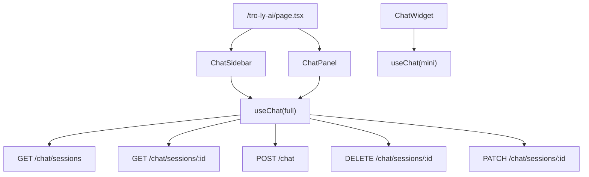

# Chatbot Landing Page — `/tro-ly-ai`

**Date:** 2026-06-22  
**Status:** Approved  
**Approach:** C — Hybrid (shared `useChat` hook)

## Overview

Standalone chatbot landing page at `/tro-ly-ai` with ChatGPT-style layout:
- **Left sidebar**: session history list, create/delete/rename sessions
- **Right panel**: full-page chat with messages, sources, suggested actions
- **Existing ChatWidget** stays on all other pages (mini mode), gains an expand button → `/tro-ly-ai`

## Requirements

| # | Requirement | Detail |
|---|-------------|--------|
| R1 | Full-page chat UI | `/tro-ly-ai` with sidebar + chat panel |
| R2 | Session history | List past sessions, click to load history |
| R3 | Session management | Delete & rename sessions |
| R4 | Anonymous allowed | Chat works without login; history only for auth users |
| R5 | ChatWidget expand | Button in widget header → `/tro-ly-ai` |
| R6 | DRY code | Shared `useChat` hook between widget and landing page |

## Architecture

### New files

```
frontend/
├── lib/
│   └── useChat.ts              # Shared chat state & API logic
├── components/
│   └── chatbot/
│       ├── ChatSidebar.tsx      # Session list sidebar
│       └── ChatPanel.tsx        # Full-page chat panel
└── app/
    └── tro-ly-ai/
        └── page.tsx             # Landing page (combines sidebar + panel)

backend/app/
├── routers/
│   └── chat.py                  # + DELETE, PATCH /chat/sessions/{id}
└── schemas/
    └── chat.py                  # + ChatSessionUpdate schema
```

### Modified files

| File | Change |
|------|--------|
| `frontend/components/chatbot/ChatWidget.tsx` | Use `useChat` hook, add expand button |
| `frontend/lib/api.ts` | Add `deleteSession`, `renameSession`, `getSessions`, `getSessionHistory` |
| `frontend/lib/types.ts` | Add any missing response types |
| `backend/app/routers/chat.py` | Add DELETE & PATCH `/chat/sessions/{id}` |

### Data flow



### `useChat` hook interface

```ts
interface UseChatOptions {
  mode: "mini" | "full";
}

interface UseChatReturn {
  // State
  messages: Message[];
  input: string;
  loading: boolean;
  sessionId: string | null;
  sessions: ChatSessionResponse[];     // full mode only
  currentSession: ChatSessionResponse | null;

  // Actions
  setInput: (v: string) => void;
  send: (text?: string) => Promise<void>;
  selectSession: (id: string) => void;  // full mode
  deleteSession: (id: string) => void;
  renameSession: (id: string, title: string) => void;
  newSession: () => void;               // full mode
}
```

## API Additions

### `DELETE /chat/sessions/{session_id}`

Delete a session and all its messages. Owned by user.

- **Auth**: Required (session must belong to user)
- **Response**: `204 No Content`
- **Errors**: 404 (not found), 403 (not owner)

### `PATCH /chat/sessions/{session_id}`

Rename a session.

```json
{ "title": "Tìm căn hộ Cầu Giấy" }
```

- **Auth**: Required
- **Response**: `ChatSessionResponse`
- **Validation**: title max 300 chars

## UI Layout

```
┌──────────────────────┬──────────────────────────────────────┐
│  🔍 Tìm session...   │  ✨ Tư vấn BĐS AI                   │
│                      │                                      │
│  ┌──────────────────┐│  ┌──────────────────────────────────┐│
│  │ 🏠 Căn hộ CG     ││  │  👤 user msg                     ││
│  │   2 giờ trước    ││  │  🤖 assistant + sources          ││
│  ├──────────────────┤│  └──────────────────────────────────┘│
│  │ 📊 Giá Q7        ││                                      │
│  │   1 ngày trước   ││  ┌──────────────────────────────────┐│
│  ├──────────────────┤│  │  💬 Type a message...      [▶]   ││
│  │ ⚖️ Sang tên sổ   ││  └──────────────────────────────────┘│
│  └──────────────────┘│                                      │
│                      │  💡 Suggested: ...                   │
│  [+ Cuộc mới]       │                                      │
└──────────────────────┴──────────────────────────────────────┘
```

- **Sidebar width**: 280px, collapsible on mobile
- **Chat panel**: flex-1, min-height 100vh - header
- **Session item**: icon + title + time + delete button on hover
- **Empty state**: "Chưa có cuộc trò chuyện nào" with CTA

## States

| State | Sidebar | Chat Panel |
|-------|---------|------------|
| No session selected | Show list | Welcome message + suggestions |
| Session selected, empty | Highlight session | Welcome + input |
| Session with history | Highlight + load msgs | Show messages |
| Loading history | Skeleton list | Skeleton messages |
| Anonymous | Empty (or hidden) | Works normally, session not saved |
| Error | Toast notification | Inline error message |

## Implementation Order

1. **Backend**: Add DELETE & PATCH endpoints
2. **API client**: Add `deleteSession`, `renameSession`, `getSessions`, `getSessionHistory` to `api.ts`
3. **useChat hook**: Extract from ChatWidget, add full-mode features
4. **Refactor ChatWidget**: Use `useChat`, add expand button
5. **ChatSidebar**: Session list component
6. **ChatPanel**: Full-page chat component
7. **Page**: `/tro-ly-ai/page.tsx` — wire everything
8. **Test**: Anonymous chat, auth chat, session CRUD, expand button

## Testing

- `npm run lint` — ESLint
- Manual: Open `/tro-ly-ai`, send message, verify history persists, delete/rename session
- Manual: Open ChatWidget on `/`, click expand → verify navigates to `/tro-ly-ai`
- Manual: Anonymous chat → sidebar hidden, chat works
- Manual: Login → sidebar shows sessions, CRUD works
