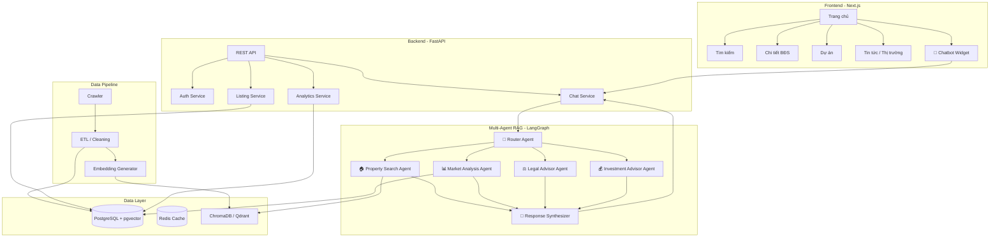
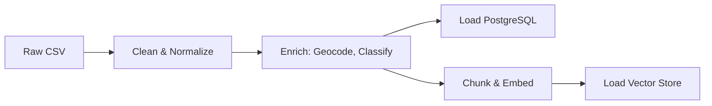
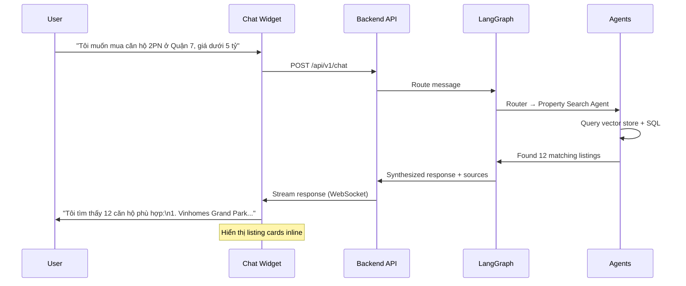
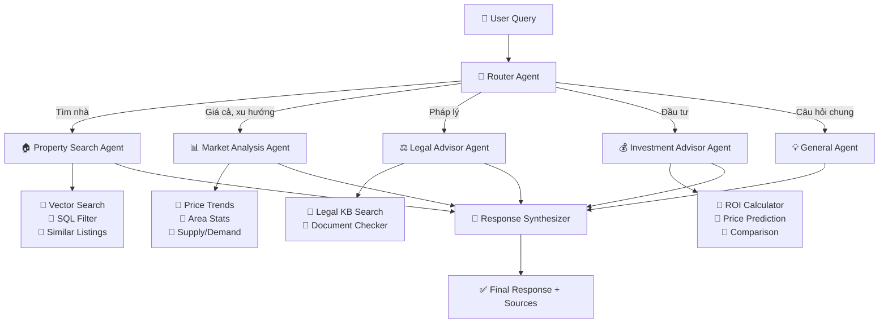

# 🏠 Ứng dụng Tư vấn Bất động sản tích hợp Chatbot Multi-Agent RAG

## Tổng quan dự án

Xây dựng nền tảng bất động sản toàn diện lấy cảm hứng từ **batdongsan.com.vn**, tích hợp **chatbot multi-agent RAG** để tư vấn thông minh về mọi vấn đề bất động sản.

## Phân tích hiện trạng

### Những gì đã có ✅

| Module | Trạng thái | Mô tả |
|--------|-----------|-------|
| **Crawler URLs** | ✅ Hoạt động | `Crawl/01.crawl_listing_url.py` - Cào URL listing song song, 8 workers |
| **Crawler Details** | ✅ Hoạt động | `Crawl/02.crawl_listing_details.py` - Cào chi tiết 20+ trường dữ liệu |
| **Merge Tool** | ✅ Hoạt động | `Crawl/merge.py` - Gộp và deduplicate CSV |
| **Backend API** | ⚠️ Cơ bản | `backend/main.py` - FastAPI đơn giản, đọc CSV, filter listings |
| **Frontend** | ⚠️ Cơ bản | `FrontEnd/` - HTML/CSS/JS tĩnh, giao diện search + listing cards |
| **Data** | ✅ Có sẵn | ~900KB apartments data, ~7.4MB listing URLs, ~800KB details |
| **RAG Module** | ❌ Trống | `RAG/` - Chưa triển khai |

### Những gì cần xây dựng 🔨

1. **Frontend hoàn chỉnh** - Nhiều trang, routing, responsive, chatbot widget
2. **Backend nâng cấp** - Database, authentication, API đầy đủ
3. **RAG Pipeline** - Vector database, embedding, retrieval
4. **Multi-Agent Chatbot** - LangGraph orchestration, specialized agents
5. **Data Pipeline** - ETL, cleaning, enrichment, scheduling

---

## 🏗️ Kiến trúc hệ thống



---

## 📦 Tech Stack

| Layer | Công nghệ | Lý do |
|-------|-----------|-------|
| **Frontend** | **Next.js 14 (App Router)** | SSR/SSG, routing, SEO tốt, React ecosystem |
| **Styling** | **Tailwind CSS + shadcn/ui** | Nhanh, consistent, component library sẵn |
| **Backend** | **FastAPI (Python)** | Async, type-safe, tích hợp ML/AI dễ dàng |
| **Database** | **PostgreSQL + pgvector** | Relational + vector search trong 1 DB |
| **Cache** | **Redis** | Cache API responses, session, rate limiting |
| **Vector Store** | **ChromaDB** (dev) / **Qdrant** (prod) | Lưu embeddings cho RAG |
| **LLM** | **Google Gemini 2.0 Flash** hoặc **GPT-4o-mini** | Giá rẻ, nhanh, đủ thông minh |
| **Embeddings** | **text-embedding-3-small** hoặc **Gemini Embedding** | Chuyển text → vector |
| **Agent Framework** | **LangGraph** | Stateful multi-agent orchestration |
| **Crawler** | **Playwright + Stealth** (đã có) | Bypass bot detection |
| **Containerization** | **Docker Compose** | Dễ deploy, quản lý services |

---

## 📁 Cấu trúc thư mục đề xuất

```
RealEstate_Chatbot_v2/
├── frontend/                     # Next.js Application
│   ├── app/
│   │   ├── layout.tsx            # Root layout + chatbot widget
│   │   ├── page.tsx              # Trang chủ
│   │   ├── nha-dat-ban/
│   │   │   ├── page.tsx          # Danh sách nhà đất bán
│   │   │   └── [slug]/page.tsx   # Chi tiết listing
│   │   ├── nha-dat-cho-thue/
│   │   │   ├── page.tsx          # Danh sách cho thuê
│   │   │   └── [slug]/page.tsx
│   │   ├── du-an/
│   │   │   ├── page.tsx          # Danh sách dự án
│   │   │   └── [slug]/page.tsx
│   │   ├── thi-truong/
│   │   │   └── page.tsx          # Dashboard thị trường
│   │   └── api/                  # Next.js API routes (proxy)
│   ├── components/
│   │   ├── layout/
│   │   │   ├── Header.tsx
│   │   │   ├── Footer.tsx
│   │   │   └── Sidebar.tsx
│   │   ├── search/
│   │   │   ├── SearchBar.tsx
│   │   │   ├── FilterPanel.tsx
│   │   │   └── SearchResults.tsx
│   │   ├── listing/
│   │   │   ├── ListingCard.tsx
│   │   │   ├── ListingGrid.tsx
│   │   │   ├── ListingDetail.tsx
│   │   │   └── ListingMap.tsx
│   │   ├── chatbot/
│   │   │   ├── ChatWidget.tsx     # Floating chat button + panel
│   │   │   ├── ChatMessage.tsx
│   │   │   ├── ChatInput.tsx
│   │   │   └── AgentIndicator.tsx # Hiển thị agent nào đang xử lý
│   │   ├── market/
│   │   │   ├── PriceChart.tsx
│   │   │   ├── HeatMap.tsx
│   │   │   └── MarketStats.tsx
│   │   └── ui/                    # shadcn/ui components
│   ├── lib/
│   │   ├── api.ts                 # API client
│   │   └── utils.ts
│   ├── public/
│   ├── package.json
│   └── tailwind.config.ts
│
├── backend/                       # FastAPI Backend
│   ├── app/
│   │   ├── __init__.py
│   │   ├── main.py                # FastAPI app + CORS + lifespan
│   │   ├── config.py              # Environment configs
│   │   ├── database.py            # SQLAlchemy + async engine
│   │   ├── models/
│   │   │   ├── listing.py         # Listing ORM model
│   │   │   ├── project.py         # Dự án BĐS model
│   │   │   ├── user.py            # User model
│   │   │   └── chat.py            # Chat history model
│   │   ├── schemas/
│   │   │   ├── listing.py         # Pydantic schemas
│   │   │   ├── chat.py
│   │   │   └── common.py          # Pagination, filters
│   │   ├── routers/
│   │   │   ├── listings.py        # CRUD listings
│   │   │   ├── projects.py        # Dự án endpoints
│   │   │   ├── search.py          # Full-text + semantic search
│   │   │   ├── market.py          # Thống kê thị trường
│   │   │   ├── chat.py            # Chat endpoints (WebSocket + REST)
│   │   │   └── auth.py            # Authentication
│   │   ├── services/
│   │   │   ├── listing_service.py
│   │   │   ├── search_service.py
│   │   │   └── chat_service.py    # Gọi RAG pipeline
│   │   └── utils/
│   │       ├── pricing.py         # Parse giá VND
│   │       └── geocoding.py       # Geocode địa chỉ → tọa độ
│   ├── alembic/                   # Database migrations
│   ├── requirements.txt
│   └── Dockerfile
│
├── rag/                           # Multi-Agent RAG System
│   ├── __init__.py
│   ├── config.py                  # LLM configs, API keys
│   ├── graph.py                   # LangGraph workflow definition
│   ├── state.py                   # Shared state schema
│   ├── agents/
│   │   ├── router.py              # 🧠 Intent classification + routing
│   │   ├── property_search.py     # 🏠 Tìm BĐS phù hợp nhu cầu
│   │   ├── market_analysis.py     # 📊 Phân tích thị trường, xu hướng giá
│   │   ├── legal_advisor.py       # ⚖️ Tư vấn pháp lý BĐS
│   │   └── investment_advisor.py  # 💰 Tư vấn đầu tư, ROI
│   ├── tools/
│   │   ├── vector_search.py       # Tìm kiếm trong vector store
│   │   ├── sql_search.py          # Query PostgreSQL
│   │   ├── price_estimator.py     # Ước tính giá BĐS
│   │   └── comparison.py          # So sánh BĐS
│   ├── retrieval/
│   │   ├── embedder.py            # Text → embeddings
│   │   ├── chunker.py             # Chia nhỏ documents
│   │   └── indexer.py             # Index documents vào vector store
│   └── prompts/
│       ├── router_prompt.py
│       ├── property_prompt.py
│       ├── market_prompt.py
│       ├── legal_prompt.py
│       └── investment_prompt.py
│
├── crawler/                       # Data Crawler (đã có, cần refactor)
│   ├── crawl_listing_url.py
│   ├── crawl_listing_details.py
│   ├── crawl_projects.py          # [MỚI] Cào thông tin dự án
│   ├── crawl_news.py              # [MỚI] Cào tin tức BĐS
│   ├── merge.py
│   └── scheduler.py               # [MỚI] Lịch cào hàng ngày
│
├── data_pipeline/                 # ETL & Data Processing
│   ├── clean.py                   # Làm sạch dữ liệu thô
│   ├── enrich.py                  # Thêm geocoding, phân loại
│   ├── embed.py                   # Tạo embeddings cho listings
│   ├── load_db.py                 # Load vào PostgreSQL
│   └── load_vectordb.py           # Load vào ChromaDB/Qdrant
│
├── data/                          # Data storage
│   ├── raw/                       # CSV thô từ crawler
│   ├── processed/                 # CSV đã xử lý
│   └── knowledge/                 # Tài liệu pháp lý, hướng dẫn mua bán
│
├── docker-compose.yml             # Orchestrate all services
├── .env                           # Environment variables
└── README.md
```

---

## 🔧 Module Chi tiết

### Module 1: Data Crawler Pipeline

> **Mục tiêu**: Cào đầy đủ dữ liệu từ batdongsan.com.vn

#### Dữ liệu cần cào

| Loại | URL Pattern | Trạng thái |
|------|------------|-----------|
| **Nhà đất bán** | `/nha-dat-ban` | ✅ Đã có |
| **Nhà đất cho thuê** | `/nha-dat-cho-thue` | 🔨 Cần thêm |
| **Dự án** | `/du-an` | 🔨 Cần thêm |
| **Tin tức** | `/tin-tuc` | 🔨 Cần thêm (tùy chọn) |

#### Cải tiến Crawler

- [ ] Mở rộng crawler cho thuê (tương tự nhà đất bán, đổi BASE_URL)
- [ ] Crawler dự án: tên, chủ đầu tư, vị trí, giá, tiện ích, tiến độ
- [ ] Thêm scheduler (APScheduler) chạy daily incremental crawl
- [ ] Retry/resume tốt hơn, log vào file

---

### Module 2: Data Processing & Storage

> **Mục tiêu**: Làm sạch, chuẩn hóa, lưu trữ và tạo embeddings

#### Pipeline xử lý dữ liệu



#### Database Schema (PostgreSQL)

```sql
-- Bảng chính: listings
CREATE TABLE listings (
    id SERIAL PRIMARY KEY,
    product_id VARCHAR(50) UNIQUE NOT NULL,
    title TEXT,
    listing_type VARCHAR(20),         -- 'sale' | 'rent'
    property_type VARCHAR(50),        -- 'apartment' | 'house' | 'land' | ...
    price DECIMAL,
    price_unit VARCHAR(20),           -- 'billion' | 'million' | 'million/month'
    area DECIMAL,
    price_per_m2 DECIMAL,
    bedrooms INT,
    bathrooms INT,
    floors INT,
    direction VARCHAR(20),
    legal_status VARCHAR(50),
    furniture VARCHAR(50),
    address TEXT,
    district VARCHAR(100),
    city VARCHAR(100),
    latitude DECIMAL,
    longitude DECIMAL,
    description TEXT,
    contact_name VARCHAR(100),
    post_date DATE,
    expiry_date DATE,
    url TEXT,
    embedding vector(1536),           -- pgvector
    created_at TIMESTAMP DEFAULT NOW(),
    updated_at TIMESTAMP DEFAULT NOW()
);

-- Bảng dự án
CREATE TABLE projects (
    id SERIAL PRIMARY KEY,
    name TEXT,
    developer VARCHAR(200),
    location TEXT,
    district VARCHAR(100),
    city VARCHAR(100),
    total_units INT,
    price_range TEXT,
    status VARCHAR(50),               -- 'upcoming' | 'selling' | 'completed'
    amenities TEXT[],
    description TEXT,
    url TEXT,
    embedding vector(1536),
    created_at TIMESTAMP DEFAULT NOW()
);

-- Chat history
CREATE TABLE chat_sessions (
    id UUID PRIMARY KEY DEFAULT gen_random_uuid(),
    user_id UUID,
    created_at TIMESTAMP DEFAULT NOW()
);

CREATE TABLE chat_messages (
    id SERIAL PRIMARY KEY,
    session_id UUID REFERENCES chat_sessions(id),
    role VARCHAR(10),                 -- 'user' | 'assistant'
    content TEXT,
    agent_used VARCHAR(50),           -- Agent nào đã xử lý
    metadata JSONB,                   -- Sources, citations
    created_at TIMESTAMP DEFAULT NOW()
);
```

---

### Module 3: Backend API (FastAPI)

> **Mục tiêu**: API layer đầy đủ cho frontend và chatbot

#### API Endpoints

```
# Listings
GET    /api/v1/listings                 # Danh sách + filter + pagination
GET    /api/v1/listings/{id}            # Chi tiết listing
GET    /api/v1/listings/search          # Full-text search
GET    /api/v1/listings/similar/{id}    # Listings tương tự (vector similarity)

# Projects  
GET    /api/v1/projects                 # Danh sách dự án
GET    /api/v1/projects/{id}            # Chi tiết dự án

# Market Data
GET    /api/v1/market/stats             # Thống kê tổng quan
GET    /api/v1/market/price-trends      # Xu hướng giá theo khu vực
GET    /api/v1/market/heatmap           # Dữ liệu heatmap

# Chat
POST   /api/v1/chat                     # Gửi tin nhắn (REST)
WS     /api/v1/chat/ws                  # WebSocket real-time chat
GET    /api/v1/chat/sessions            # Lịch sử chat
GET    /api/v1/chat/sessions/{id}       # Chi tiết session

# Location
GET    /api/v1/locations/cities         # Danh sách tỉnh/thành
GET    /api/v1/locations/districts      # Danh sách quận/huyện

# Categories
GET    /api/v1/categories               # Loại hình BĐS
```

#### Ví dụ filter query:
```
GET /api/v1/listings?
    type=sale
    &property_type=apartment
    &city=Hồ Chí Minh
    &district=Quận 7
    &min_price=3
    &max_price=6
    &min_area=60
    &bedrooms=2
    &sort=price_asc
    &page=1
    &limit=20
```

---

### Module 4: Frontend (Next.js)

> **Mục tiêu**: Giao diện đẹp, nhanh, giống batdongsan.com + chatbot tích hợp

#### Các trang chính

| Trang | Route | Mô tả |
|-------|-------|-------|
| **Trang chủ** | `/` | Hero search, quick links, featured listings, market stats |
| **Nhà đất bán** | `/nha-dat-ban` | Search + filter + grid listings + map view |
| **Nhà đất cho thuê** | `/nha-dat-cho-thue` | Tương tự nhà đất bán |
| **Chi tiết** | `/nha-dat-ban/[slug]` | Gallery, specs, map, listings tương tự |
| **Dự án** | `/du-an` | Grid dự án + filter |
| **Chi tiết dự án** | `/du-an/[slug]` | Info, mặt bằng, listings trong dự án |
| **Thị trường** | `/thi-truong` | Charts, heatmap, price trends |

#### UI Components Chính

1. **Header**: Logo, nav menu, search bar, đăng nhập/đăng ký
2. **Search Panel**: Tabs (Bán/Thuê/Dự án), search input, filters (khu vực, giá, diện tích, loại hình)
3. **Listing Card**: Ảnh, badge, title, giá, diện tích, phòng ngủ/WC, location
4. **Listing Grid**: Responsive grid + pagination + sort
5. **Map View**: Interactive map với markers (Leaflet/MapboxGL)
6. **Chart Dashboard**: Biểu đồ giá, heatmap khu vực (Recharts/Chart.js)
7. **Chat Widget**: Floating button → expandable chat panel

#### Chatbot Widget Flow



---

### Module 5: Multi-Agent RAG Chatbot 🤖

> **Mục tiêu**: Chatbot thông minh tư vấn mọi khía cạnh BĐS

#### Kiến trúc Multi-Agent



#### Chi tiết từng Agent

##### 1. 🧠 Router Agent
- **Chức năng**: Phân loại intent của user, quyết định agent nào xử lý
- **Input**: User query + conversation history
- **Output**: Routing decision (1 hoặc nhiều agents)
- **Ví dụ routing**:
  - "Tìm căn hộ 2PN Quận 7" → Property Search
  - "Giá nhà Quận 2 có tăng không?" → Market Analysis
  - "Thủ tục mua nhà lần đầu?" → Legal Advisor
  - "Nên đầu tư đất nền hay chung cư?" → Investment Advisor
  - "Tìm căn hộ Quận 7, so sánh giá với Quận 2" → Property Search + Market Analysis

##### 2. 🏠 Property Search Agent
- **Tools**: Vector search trên listing embeddings, SQL filter, similar listings
- **Khả năng**:
  - Tìm BĐS theo yêu cầu tự nhiên
  - Gợi ý BĐS tương tự
  - So sánh 2-3 BĐS cụ thể
  - Lọc theo tiêu chí phức hợp

##### 3. 📊 Market Analysis Agent
- **Tools**: SQL aggregate queries, price trend analysis
- **Khả năng**:
  - Phân tích xu hướng giá theo khu vực/thời gian
  - So sánh giá giữa các khu vực
  - Thống kê cung-cầu
  - Dự đoán xu hướng (dựa trên dữ liệu lịch sử)

##### 4. ⚖️ Legal Advisor Agent
- **Tools**: RAG trên knowledge base pháp lý
- **Knowledge Base**:
  - Luật Nhà ở 2023
  - Luật Kinh doanh BĐS 2023  
  - Luật Đất đai 2024
  - Quy trình mua bán, thủ tục công chứng
  - Thuế, phí chuyển nhượng
- **Khả năng**:
  - Tư vấn thủ tục mua bán
  - Kiểm tra pháp lý
  - Tính thuế/phí

##### 5. 💰 Investment Advisor Agent
- **Tools**: ROI calculator, comparison, price prediction
- **Khả năng**:
  - Đánh giá tiềm năng đầu tư
  - Tính toán ROI, yield cho thuê
  - So sánh kênh đầu tư
  - Phân tích rủi ro

#### State Schema (LangGraph)

```python
from typing import TypedDict, Annotated, Literal
from langgraph.graph import MessagesState

class ChatState(MessagesState):
    """Shared state across all agents."""
    # Routing
    intent: str                          # Classified intent
    target_agents: list[str]             # Which agents to invoke
    
    # Search context
    search_filters: dict                 # Extracted filters from query
    retrieved_listings: list[dict]       # Found listings
    retrieved_docs: list[dict]           # Retrieved knowledge docs
    
    # Agent results
    agent_results: dict[str, str]        # Results from each agent
    
    # Final
    final_response: str                  # Synthesized response
    sources: list[dict]                  # Citations
    suggested_actions: list[str]         # Follow-up suggestions
```

---

## 🚀 Kế hoạch triển khai (4 Phases)

### Phase 1: Foundation (Tuần 1-2)
> Database, Backend API, Data Pipeline

- [ ] Setup PostgreSQL + pgvector (Docker)
- [ ] Tạo database schema + Alembic migrations
- [ ] Refactor backend: SQLAlchemy models, Pydantic schemas
- [ ] Implement CRUD API endpoints cho listings
- [ ] Data pipeline: clean → enrich → load PostgreSQL
- [ ] Mở rộng crawler cho nhà đất cho thuê + dự án

### Phase 2: Frontend (Tuần 2-3)
> Next.js app với giao diện hoàn chỉnh

- [ ] Init Next.js project + Tailwind + shadcn/ui
- [ ] Trang chủ: Hero, Search Panel, Quick Links, Featured Listings
- [ ] Trang danh sách: Filter sidebar + Listing grid + Pagination
- [ ] Trang chi tiết: Gallery, Specs, Map, Similar listings
- [ ] Trang dự án + Dashboard thị trường
- [ ] Responsive design + micro-animations

### Phase 3: RAG & Chatbot (Tuần 3-4)
> Multi-agent system + Vector store

- [ ] Setup ChromaDB/Qdrant
- [ ] Tạo embeddings cho tất cả listings + knowledge docs
- [ ] Implement LangGraph workflow
- [ ] Build 5 agents + tools
- [ ] Chat API endpoint (REST + WebSocket)
- [ ] Frontend: Chat widget component

### Phase 4: Polish & Deploy (Tuần 4-5)
> Testing, optimization, deployment

- [ ] Integration testing
- [ ] Performance optimization (caching, lazy loading)
- [ ] Docker Compose sản xuất
- [ ] CI/CD pipeline
- [ ] Documentation

---

## ⚙️ Docker Compose (dự kiến)

```yaml
services:
  # PostgreSQL + pgvector
  postgres:
    image: pgvector/pgvector:pg16
    environment:
      POSTGRES_DB: realestate
      POSTGRES_USER: admin
      POSTGRES_PASSWORD: ${DB_PASSWORD}
    volumes:
      - pgdata:/var/lib/postgresql/data
    ports:
      - "5432:5432"

  # Redis
  redis:
    image: redis:7-alpine
    ports:
      - "6379:6379"

  # ChromaDB (Vector Store)
  chromadb:
    image: chromadb/chroma:latest
    ports:
      - "8001:8000"
    volumes:
      - chromadata:/chroma/chroma

  # Backend API
  backend:
    build: ./backend
    ports:
      - "8000:8000"
    depends_on:
      - postgres
      - redis
      - chromadb
    env_file: .env

  # Frontend
  frontend:
    build: ./frontend
    ports:
      - "3000:3000"
    depends_on:
      - backend

volumes:
  pgdata:
  chromadata:
```

---

## 📋 Câu hỏi cần xác nhận

> [!IMPORTANT]
> Vui lòng xác nhận các lựa chọn sau trước khi bắt đầu triển khai:

1. **LLM Provider**: Bạn muốn dùng **Google Gemini** hay **OpenAI GPT**? (Ảnh hưởng đến API key và chi phí)

2. **Frontend Framework**: Plan dùng **Next.js** (full-featured, SSR). Bạn có muốn giữ **vanilla HTML/CSS/JS** hiện tại không, hay đồng ý chuyển sang Next.js?

3. **Phạm vi Phase 1**: Bạn muốn bắt đầu từ module nào trước?
   - A) Backend + Database (foundation)
   - B) Frontend (giao diện batdongsan.com)
   - C) RAG Chatbot (core feature)

4. **Authentication**: Có cần hệ thống đăng nhập/đăng ký không? Hay chỉ cần chatbot ẩn danh?

5. **Deployment target**: Deploy ở đâu? (Local Docker, VPS, Cloud - AWS/GCP?)
